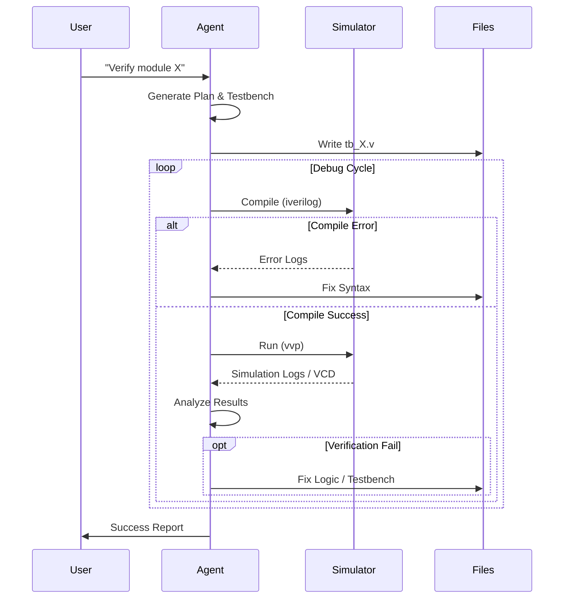

# Architecture

## High-Level Workflow

The agent operates as an intelligent loop between the user, the codebase, and the simulation tools.

```mermaid
graph TD
    User[User / Editor] -->|Request| Agent[Verilog ACP Agent]
    Agent -->|Read/Write| Files[Verilog Files]
    Agent -->|Execute| Sim[Simulator (iverilog)]
    Sim -->|Logs/VCD| Agent
    Agent -->|Response/Diffs| User
```

## Simulation Loop

When a verification task is requested, the agent follows a strict analyze-simulate-debug cycle.


