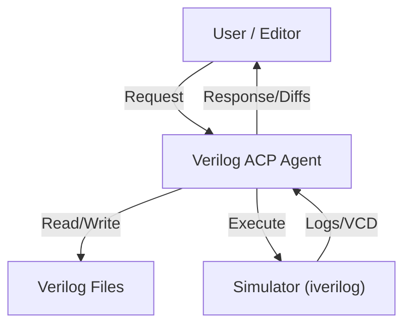

# Verilog-TestBench-ACP-Agent

**Hardware-Aware Autonomous Coding Agent**

A specialized agent **powered by Gemini 3**, designed to generate high-quality Verilog/SystemVerilog RTL, testbenches, and UVM components. It integrates with editors via the Agent Client Protocol (ACP) to provide a seamless hardware design workflow.

## Architecture

The agent operates as an intelligent loop, bridging the gap between natural language requirements and rigorous hardware verification.



## Workflow

The agent follows a strict **Plan → Act → Verify** cycle to ensure design correctness:

1.  **Understand**: The agent analyzes natural language requests (e.g., "Build a FIFO").
2.  **Plan**: It formulates a design strategy and test plan.
3.  **Implement**: It generates RTL and Testbench files using ACP directives.
4.  **Verify**: It autonomously compiles and simulates the design.
5.  **Debug**: If simulation fails, it analyzes logs/waveforms and iteratively fixes the code.

## Tool Manifest

The agent is equipped with specialized tools to handle the hardware design lifecycle:

| Tool               | Description                                            |
| :----------------- | :----------------------------------------------------- |
| `file_read`        | Inspects workspace files to understand existing logic. |
| `file_write`       | Creates new Verilog modules and testbenches.           |
| `apply_diff`       | Applies surgical edits to fix bugs or refactor code.   |
| `run_simulation`   | Compiles (iverilog) and runs (vvp) testbenches.        |
| `lint_verilog`     | Checks for syntax errors before simulation.            |
| `waveform_extract` | Analyzes VCD files to debug signal timing issues.      |

## Example

**User Input:**

> "Create a 4-bit synchronous counter with active-high reset."

**Agent Output (RTL):**

```verilog
module counter_4bit (
    input clk,
    input rst,
    output reg [3:0] count
);
    always @(posedge clk) begin
        if (rst)
            count <= 4'b0000;
        else
            count <= count + 1;
    end
endmodule
```

**Agent Output (Testbench):**

```verilog
module tb_counter;
    reg clk, rst;
    wire [3:0] count;
    counter_4bit dut (clk, rst, count);

    initial begin
        rst = 1; #10 rst = 0;
        wait(count == 4'd15);
        $finish;
    end
endmodule
```

**Simulation Result:**

```text
VCD info: dumpfile dump.vcd opened for output.
tests passed: counter reached 15.
```

## Setup & Prerequisites

1.  **Icarus Verilog**: [Download (Windows)](https://bleyer.org/icarus/)
    - Ensure `iverilog` and `vvp` are in your PATH.
2.  **GTKWave**: Optional, for viewing `dump.vcd`.

## License

MIT
